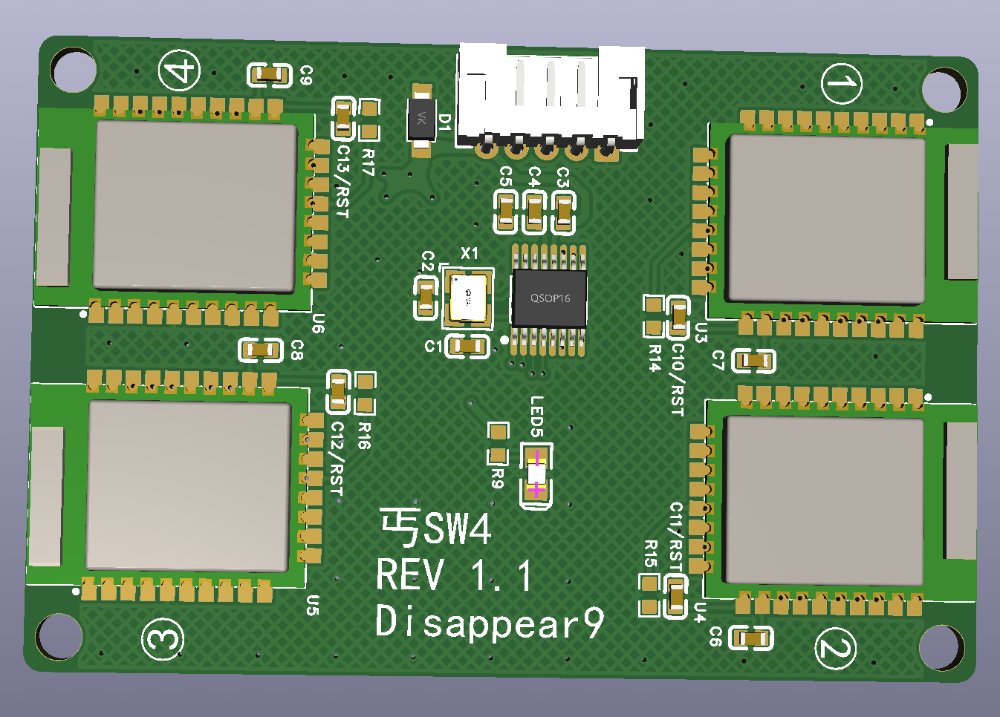
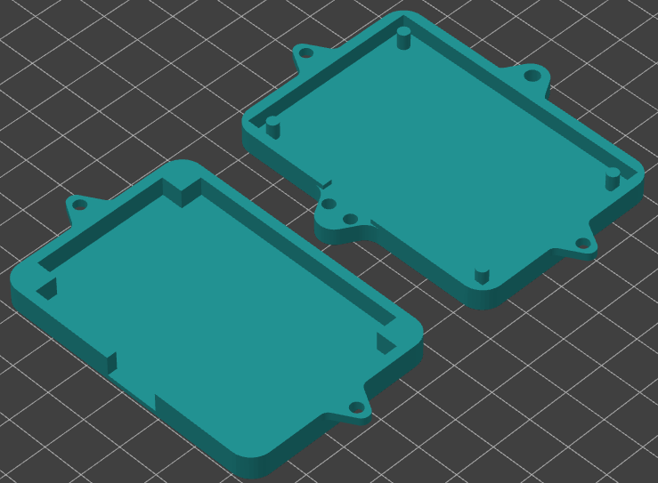

# SW4-Poor
4 x SteamVR Dongles 一拖4 SteamVR 接收器 (丐版SW4)  
  

## 说明
之前设计的一拖4接收器，稳定运行一年多没发现什么问题，最近整理资料翻出来了重新布线整理后发出来。  
可以刷入index头显的固件或SW4的固件，短接后面的触点后即可识别为接收器。  
不提供固件下载防止工程被DMCA。  

阻抗类型 JLC041611-3313  
需要 亿佰特E73-2G4M08S1C模块 *4  
使用CH334R USB HUB控制器芯片，支持MTT  

## 工程内容
```
Case        外壳文件
Gerber      Gerber文件，可直接发给JLC打样
SCH         原理图
PROJ        立创EDA（LCEDA）工程
Misc        杂项，焊接辅助BOM和图片
```

## 组装说明
打印外壳  
  
需要：
```
M3*8盘头螺丝    *2
鼠标用USB线     *1（需要自己按照原理图调整线序）
扎带            *2
```
## LICENSE
CC BY-NC-SA 4.0 署名—非商业性使用—相同方式共享 4.0 协议国际版  
